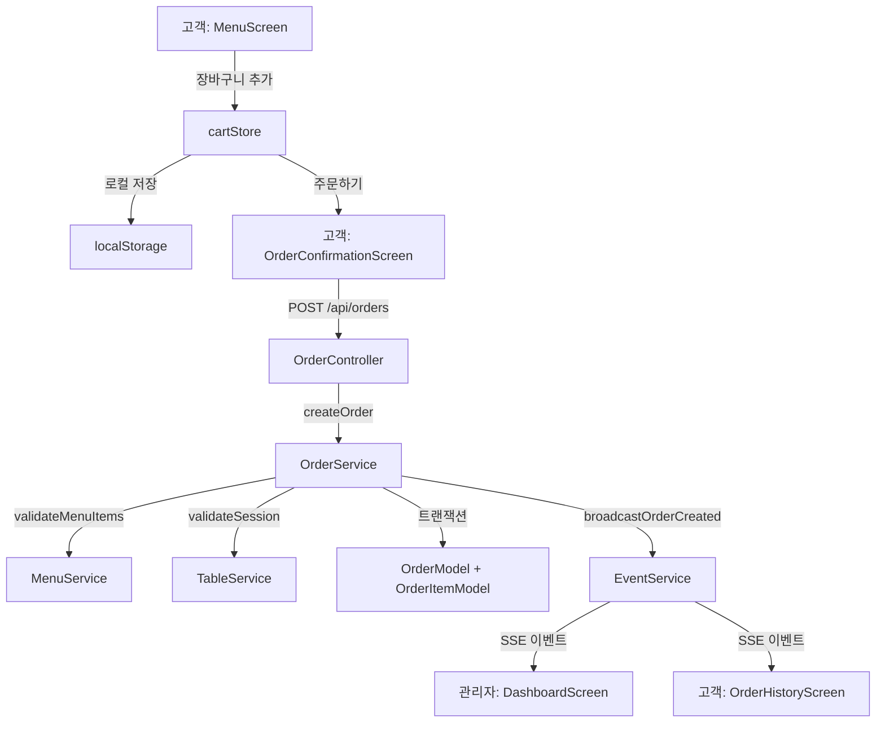

# 컴포넌트 의존성 및 데이터 흐름

## 의존성 매트릭스

### 서버 컴포넌트 의존성

| 컴포넌트 | 의존 대상 | 의존 유형 | 설명 |
|---|---|---|---|
| **AuthController** | AuthService | 직접 호출 | JWT 생성 및 검증 |
| **AuthController** | ResponseHelper | 유틸리티 | 통일된 응답 포맷 |
| **AuthService** | UserModel | 데이터 접근 | 사용자 정보 조회 |
| **AuthService** | bcrypt 라이브러리 | 외부 라이브러리 | 비밀번호 해싱 |
| **AuthMiddleware** | jwt 라이브러리 | 외부 라이브러리 | 토큰 검증 |
| **OrderController** | OrderService | 직접 호출 | 주문 비즈니스 로직 |
| **OrderService** | MenuService | 서비스 협력 | 메뉴 유효성 확인 |
| **OrderService** | TableService | 서비스 협력 | 테이블 세션 확인 |
| **OrderService** | EventService | 서비스 협력 | 실시간 이벤트 발행 |
| **OrderService** | OrderModel | 데이터 접근 | 주문 데이터 CRUD |
| **EventService** | 모든 Controller | 이벤트 구독 | 이벤트 발행 요청 수신 |
| **SSEController** | EventService | 직접 호출 | SSE 연결 등록 |

### 프론트엔드 컴포넌트 의존성

| 컴포넌트 | 의존 대상 | 의존 유형 | 설명 |
|---|---|---|---|
| **MenuScreen** | menuStore | 상태 관리 | 메뉴 목록 조회 |
| **MenuScreen** | cartStore | 상태 관리 | 장바구니 추가 |
| **CartScreen** | cartStore | 상태 관리 | 장바구니 상태 |
| **CartScreen** | orderStore | 상태 관리 | 주문 생성 |
| **DashboardScreen** | tableStore | 상태 관리 | 테이블 현황 |
| **DashboardScreen** | orderStore | 상태 관리 | 주문 현황 |
| **SSEListener** | EventSource API | 브라우저 API | SSE 연결 |
| **LocalCartProvider** | localStorage API | 브라우저 API | 로컬 저장 |

---

## 통신 패턴

### 1. 동기적 HTTP 요청/응답 패턴
```
┌─────────┐     HTTP Request     ┌─────────────┐     Service Call     ┌───────────┐
│ Client  │ ───────────────────> │ Controller  │ ───────────────────> │  Service  │
│         │                      │             │                      │           │
│         │    HTTP Response     │             │                      │   Model   │
│         │ <─────────────────── │             │ <─────────────────── │           │
└─────────┘                      └─────────────┘                      └───────────┘
```

### 2. 실시간 SSE 패턴
```
┌─────────┐     SSE Connect      ┌─────────────┐     Register         ┌───────────┐
│ Client  │ ───────────────────> │ SSE Stream  │ ───────────────────> │  Event    │
│         │                      │             │                      │  Service  │
│         │    Event Stream      │             │                      │           │
│         │ <─────────────────── │             │ <─ Broadcast Event ──┤           │
└─────────┘                      └─────────────┘                      └───────────┘
                                          ^
                                          │ Notify Event
                                          │
                                   ┌──────┴──────┐
                                   │   Service   │
                                   │ (Order/Menu)│
                                   └─────────────┘
```

### 3. 서비스 협력 패턴
```
┌───────────┐     validateMenuItems()    ┌───────────┐
│ Order     │ ─────────────────────────> │   Menu    │
│ Service   │                            │  Service  │
│           │     Menu[]                 │           │
│           │ <───────────────────────── │           │
│           │                            └───────────┘
│           │     validateSession()      ┌───────────┐
│           │ ─────────────────────────> │   Table   │
│           │                            │  Service  │
│           │     true/false             │           │
│           │ <───────────────────────── │           │
│           │                            └───────────┘
│           │     broadcastOrderCreated() ┌───────────┐
│           │ ──────────────────────────> │   Event   │
│           │                            │  Service  │
│           │     void                   │           │
│           │ <───────────────────────── │           │
└───────────┘                            └───────────┘
```

---

## 데이터 흐름 다이어그램

### 고객 주문 흐름


### 관리자 모니터링 흐름
```mermaid
flowchart TD
    A[관리자 로그인] -->|POST /api/auth/login| B[AuthController]
    B -->|authenticate| C[AuthService]
    C -->|JWT 발급| D[토큰 저장]
    D -->|SSE 연결| E[SSEController]
    E -->|registerClient| F[EventService]
    G[관리자: DashboardScreen] -->|GET /api/orders/dashboard| H[OrderController]
    H -->|getDashboardData| I[OrderService + TableService]
    I -->|TableDashboardItem[]| G
    
    F -->|실시간 이벤트| G
    J[다른 고객 주문] -->|broadcastOrderCreated| F
```

### 메뉴 관리 흐름
```mermaid
flowchart TD
    A[관리자: MenuManagementScreen] -->|GET /api/menus| B[MenuController]
    B -->|getMenus| C[MenuService]
    C -->|findAll| D[MenuModel]
    D -->|Menu[]| C
    C -->|Menu[]| B
    B -->|Menu[]| A
    
    E[메뉴 추가] -->|POST /api/menus| B
    B -->|createMenu| C
    C -->|create| D
    D -->|Menu| C
    C -->|Menu| B
    B -->|Menu| A
```

---

## 순환 의존성 분석

### 감지된 순환 의존성 없음
1. **Auth ↔ Order**: 순환 없음 (Auth는 Order에 의존하지 않음)
2. **Order ↔ Menu**: 단방향 (Order → Menu)
3. **Order ↔ Table**: 단방향 (Order → Table)  
4. **Event ↔ All**: 중앙 집중식 (모든 서비스 → Event, Event → 클라이언트)

### 의존성 방향
```
           ┌─────────┐
           │  Event  │
           │ Service │
           └────┬────┘
                │
    ┌──────┬────┴────┬──────┐
    │      │         │      │
    v      v         v      v
┌──────┐┌──────┐┌──────┐┌──────┐
│ Auth ││Order ││ Table││ Menu │
│Service││Service││Service││Service│
└──────┘└──────┘└──────┘└──────┘
    │      │         │      │
    v      v         v      v
┌──────┐┌──────┐┌──────┐┌──────┐
│ Auth ││Order ││ Table││ Menu │
│ Model││ Model││ Model││ Model│
└──────┘└──────┘└──────┘└──────┘
```

---

## 외부 의존성

### 서버 의존성
```typescript
// package.json dependencies
"express": "^4.18.0",        // HTTP 서버 프레임워크
"knex": "^3.1.0",           // SQL 쿼리 빌더
"pg": "^8.11.0",            // PostgreSQL 드라이버
"jsonwebtoken": "^9.0.0",   // JWT 토큰
"bcrypt": "^5.1.0",         // 비밀번호 해싱
"zod": "^3.22.0",           // 입력 검증
"cors": "^2.8.5",           // CORS 미들웨어
```

### 클라이언트 의존성
```typescript
// client/package.json dependencies
"react": "^18.3.0",         // UI 라이브러리
"zustand": "^4.5.0",        // 상태 관리
"axios": "^1.6.0",          // HTTP 클라이언트
"react-router-dom": "^6.22.0", // 라우팅
```

---

## 성능 고려사항

### 1. 데이터베이스 접근 패턴
- **즉시 로딩**: 자주 함께 사용되는 데이터 (Order + OrderItem)
- **지연 로딩**: 덜 자주 사용되는 데이터 (Menu 이미지)
- **캐싱**: 메뉴 목록 (Redis 추가 가능)

### 2. SSE 연결 관리
- **하트비트**: 30초 간격 연결 유지
- **재연결**: 클라이언트 측 자동 재연결
- **커넥션 풀**: 서버 측 연결 풀 관리

### 3. API 응답 최적화
- **페이징**: 주문 내역 페이징
- **필드 선택**: 필요한 필드만 선택적 반환
- **캐시 헤더**: 정적 메뉴 데이터 캐싱
