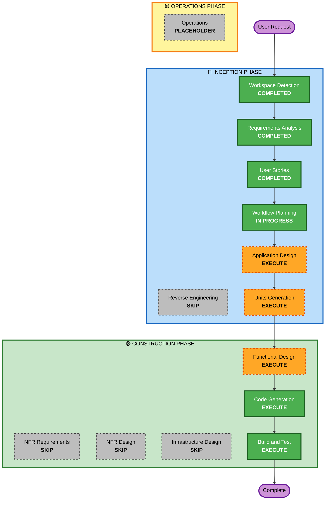

# Execution Plan

## Detailed Analysis Summary

### Project Context
- **Project Type**: Brownfield (scaffolding only, no business logic)
- **Primary Changes**: 테이블오더 MVP 전체 구현 (서버 API + 클라이언트 2개 앱)
- **Complexity**: Moderate (다중 사용자, 실시간 통신, 세션 관리)

### Change Impact Assessment
- **User-facing changes**: Yes (고객/관리자 인터페이스 전체 신규 개발)
- **Structural changes**: Yes (새로운 API 엔드포인트, 상태 관리, SSE 연결)
- **Data model changes**: Yes (PostgreSQL 스키마 설계 필요)
- **API changes**: Yes (RESTful API + SSE 엔드포인트)
- **NFR impact**: Yes (Security Extension 적용, 실시간 통신, 인증/세션)

### Risk Assessment
- **Risk Level**: Medium
- **Rollback Complexity**: Easy (초기 개발 단계, DB 마이그레이션 관리 필요)
- **Testing Complexity**: Moderate (단위 테스트 + 통합 테스트 + E2E)

---

## Workflow Visualization

---

## Phases to Execute

### 🔵 INCEPTION PHASE
- [x] Workspace Detection (COMPLETED)
- [x] Reverse Engineering — **SKIP**: No existing business logic to analyze
- [x] Requirements Analysis (COMPLETED)
- [x] User Stories (COMPLETED)
- [x] Workflow Planning (IN PROGRESS)
- [ ] Application Design — **EXECUTE**
  - **Rationale**: 새로운 컴포넌트(서비스, 모델, API) 정의 필요. 데이터베이스 스키마 설계 필요.
- [ ] Units Generation — **EXECUTE**
  - **Rationale**: 여러 단위의 작업으로 분해 필요 (Server, Client-Customer, Client-Admin)

### 🟢 CONSTRUCTION PHASE
- [ ] Functional Design — **EXECUTE**
  - **Rationale**: 새로운 데이터 모델, 복잡한 비즈니스 로직(세션 관리, 주문 상태 전이) 설계 필요
- [ ] NFR Requirements — **SKIP**
  - **Rationale**: 기술 스택 이미 결정됨. Security Extension은 이미 적용되어 있어 별도 NFR 단계 불필요.
- [ ] NFR Design — **SKIP**
  - **Rationale**: NFR Requirements 단계 스킵으로 함께 스킵
- [ ] Infrastructure Design — **SKIP**
  - **Rationale**: 개발 환경용 Docker Compose만 필요. 별도 인프라 설계 불필요.
- [ ] Code Generation — **EXECUTE** (ALWAYS)
  - **Rationale**: 실제 코드 구현 필요
- [ ] Build and Test — **EXECUTE** (ALWAYS)
  - **Rationale**: 빌드 및 테스트 검증 필요

### 🟡 OPERATIONS PHASE
- [ ] Operations — **PLACEHOLDER**

---

## Estimated Timeline
- **Total Stages to Execute**: 6 stages
- **INCEPTION Remaining**: Application Design, Units Generation
- **CONSTRUCTION**: Functional Design, Code Generation, Build and Test

## Success Criteria
- **Primary Goal**: 테이블오더 MVP 기능 완전 구현
- **Key Deliverables**:
  - PostgreSQL 스키마 및 마이그레이션
  - Express API 서버 (인증, 메뉴, 주문, SSE)
  - React 고객용 앱 (주문 플로우)
  - React 관리자용 앱 (대시보드, 관리 기능)
  - Docker Compose 개발 환경
- **Quality Gates**:
  - 모든 API 단위 테스트 통과
  - Security Extension 규칙 준수
  - 요구사항 100% 커버리지
